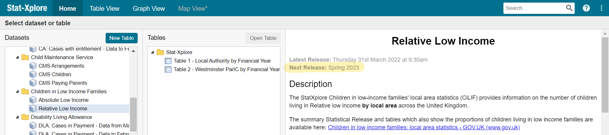

## Introduction

This repository demonstrates proposed improvements to the data pipeline for the CPOP dashboard. It obtains Local Authority level data for eleven datasets for nine indicators from five APIs. It then feeds this data into a mock-up of the 'CPP Over Time' tab of the [original dashboard](https://scotland.shinyapps.io/is-community-planning-outcomes-profile/){target="_blank"}. 

## Dashboard Structure

The dashboard itself is created from three standard shiny scripts `global.R` `server.R` and `ui.R`. The data for this dashboard is generated entirely from APIs and compiled into one csv: _/cpop_data/masterdata_dd_mm_yy.csv_ which is read into the `global.R` file.

The scripts which obtain the data from five APIs are within the _/data_update/API_queries_ folder and divided into three sub folders ( _/run_first_, _/run_second_ and _/run_third_ ), named to indicate the order in which they have to be run. This is important because some scripts depend on denominator data in the form of a csv output generated in another script. 

## Data by API

| Indicator | Dataset | Source | API | Cusom Package required? | Script Name
| ---       | ---     | ---    | --- |    --- | --- |
|Healthy Birthweight | Appropriate Birthweight for Gestational Age |[PHS](https://www.opendata.nhs.scot/dataset/births-in-scottish-hospitals/resource/a5d4de3f-e340-455f-b4e4-e26321d09207){target="_blank"} | [PHS Open Data API](https://www.opendata.nhs.scot/){target="_blank"} | [phsopendata()](https://github.com/Public-Health-Scotland/phsopendata){target="_blank"} | run_second/healthy_birthweight.R |
|Primary 1 Body Mass Index | Clinical BMI at Council Area Level | [PHS](https://www.opendata.nhs.scot/dataset/primary-1-body-mass-index-bmi-statistics/resource/4a3daa0f-1580-4a59-ac9e-64d9a31a4429){target="_blank"} | [PHS Open Data API](https://www.opendata.nhs.scot/){target="_blank"} | [phsopendata()](https://github.com/Public-Health-Scotland/phsopendata){target="_blank"} | run_second/primary_1_body_mass_index.R |
|Child Poverty | Numerator: Children in Low Income Families (Relative Low Income) | [Stat-Xplore](https://stat-xplore.dwp.gov.uk/webapi/jsf/login.xhtml){target="_blank"} | [Stat-Xplore API](https://stat-xplore.dwp.gov.uk/webapi/online-help/Open-Data-API.html){target="_blank"} |  [statxplorer()](https://github.com/houseofcommonslibrary/statxplorer){target="_blank"} | run_second/child_poverty.R |
| | Denominator: Mid-Year Population Estimate (children aged 0-15) |[Statistics.gov.scot](https://statistics.gov.scot/resource?uri=http%3A%2F%2Fstatistics.gov.scot%2Fdata%2Frecorded-crime){target="_blank"}| [statistics.gov.scot API](https://guides.statistics.gov.scot/category/37-api){target="_blank"} | _none_ | run_first/under_16_population_cpp.R |
|Educational Attainment | Educational Attainment of School Leavers | [statistics.gov.scot](https://statistics.gov.scot/data/educational-attainment-of-school-leavers){target="_blank"} | [statistics.gov.scot API](https://guides.statistics.gov.scot/category/37-api){target="_blank"}  | _none_ | run_second/educational_attainment.R |
|Employment Rate | Annual Population Survey - Employment Rate (16-64) | [Nomis](https://www.nomisweb.co.uk/datasets/apsnew){target="_blank"} | [Nomis API](https://www.nomisweb.co.uk/api/v01/help){target="_blank"} | _none_ | run_second/employment_rate.R |
|Out of Work Benefits | Numerator: Benefit Combinations (Out of Work) | [Stat-Xplore](https://stat-xplore.dwp.gov.uk/webapi/jsf/login.xhtml){target="_blank"} |  [Stat-Xplore API](https://stat-xplore.dwp.gov.uk/webapi/online-help/Open-Data-API.html){target="_blank"} | [statxplorer()](https://github.com/houseofcommonslibrary/statxplorer){target="_blank"} | run_second/out_of_work_benefits.R |
| | Denominator: Mid-Year Population Estimate (Working age 16-64) |[Statistics.gov.scot](https://statistics.gov.scot/resource?uri=http%3A%2F%2Fstatistics.gov.scot%2Fdata%2Frecorded-crime){target="_blank"}| [statistics.gov.scot API](https://guides.statistics.gov.scot/category/37-api){target="_blank"} | _none_  | run_first/working_age_population_cpp.R |
| Median Pay | Annual Survey of Hours and Earnings (Table 8) | [Nomis](https://www.nomisweb.co.uk/datasets/ashe){target="_blank"} | [Nomis API](https://www.nomisweb.co.uk/api/v01/help){target="_blank"}| _none_ | run_second/median_pay.R |
| Crimes per 1000 population | Recorded Crimes and Offences | [Statistics.gov.scot](https://statistics.gov.scot/resource?uri=http%3A%2F%2Fstatistics.gov.scot%2Fdata%2Frecorded-crime){target="_blank"}| [statistics.gov.scot API](https://guides.statistics.gov.scot/category/37-api){target="_blank"} | _none_ | run_second/crime_rate.R |
| Wellbeing | Annual Personal Wellbeing Estimates | [ONS](https://www.ons.gov.uk/peoplepopulationandcommunity/wellbeing/datasets/headlineestimatesofpersonalwellbeing){target="_blank"}|[ONS API](https://developer.ons.gov.uk/){target="_blank"} | [onsr](https://github.com/kvasilopoulos/onsr){target="_blank"} | run_second/wellbeing.R |

*** 

## Data Update Steps 

### 1. Clone This Repository
Once you have [cloned](https://docs.github.com/en/repositories/creating-and-managing-repositories/cloning-a-repository){target="_blank"} this repository, in RStudio, in the console run `renv::restore()` to synchronize your package library with that in the lockfile to ensure package dependencies for this project are met. Note: if you are asked to run `renv::activate()`, do so.

### 2. Check if JSON Update is Required
The StatXplore API queries use `.json` files which can be auto-generated using the StatXplore table-generator UI. These query specific time-series dates so have to be manually updated as new data becomes available (once annually). 
To check whether these files need updated, go to _/data_update/json/_ and take note of the dates in the files name (mm_yy) for a given dataset. Then log in to statxplore and check whether there has been new release since that date.

If there has been a release since the month/year in the current file names, follow [these instructions](#obtain-json-files) to obtain new files and update file references in scripts.

### 3. Run API Scripts
Run the  `/data_update/update_data.R` file.
This runs all individual API query scripts (within _/data_update/API_queries_) in the correct order. Since this involves 11 successive API calls it might take a minute or two to complete. The last script called _(/data_update/API_scripts/run_third/master_data.R)_  contains code which automatically updates the file reference in the `global.R` script ro read newest metadata. 

The dashboard should show the latest data when run.

Should you encounter an error running the _/data_update/update_data.R_ file. You can manually run the scripts in the  _/data_update/API_queries/_ folder one by one following the order dictated by the folder names: _/run_first_, _/run_second_ and _/run_third_ to find the issue.

***
## Obtain JSON Files

#### Out of Work Benefits .json File
1. Visit [Stat-Xplore](https://stat-xplore.dwp.gov.uk/webapi/jsf/login.xhtml){target="_blank"} and log-in/sign up.
2. Go to  _Datasets > Benefit Combinations > Benefit Combinations - Data from February 2019_, and click the blue _'New Table'_ button above.
3. Go to  _Geography > National_Regional_LA_OAs > Great Britain_. Click on the small arrow to the RIGHT of _Scotland_ and select _Local Authority_. This should select all Scottish LAs. Click the _Row_ button above to add to table.
4. Click on _Quarter_ and select checkboxes for all _May_ quarters available. Click the _Column_ button above to add to table.
5. Under _Benefit Groups_ click on _Benefit Combinations (Out of Work)_. Click the button to the RIGHT of this and select again _Benefit Combinations (Out of Work)_. This will check all benefit categories. **IT IS IMPORTANT TO DESELECT/UNCHECK THE BOX NEXT TO _not on out of work benefits_**. Then click the _Column_ button from the top again to add to table. Should you be warned about entering large table mode, select okay.
6. In the top right corner there is a select drop down menu, select _Open Data API Query (.json)_ then press go. This will download a json file.
7. save this file to _/data_update/json/_ with the name _oowb_mm_yy.json_ (with the relevant month_year). Moving older json to historic_json after.
(The above steps can be repeated to obtain oowb_historic data by clicking on 'Benefit Combinations - Data to November 2018' at step 2 - whilst this dataset will not include more years, there may be historic updates to the data so it would be worth updating the json file).
8. Open the _/data_update/json/update_json_references.R_ file. These are the first lines:

`#UPDATE when new .json files are added with format "mm_yy"`
`child_poverty <- "08_22"`
`oowb <- "08_22"`
`oowb_historic <- "08_22"`

Update the appropriate variable (say oowb) with the date which corresponds to the newly created R file. Run this code. This will update the file name referenced in the scripts which depend on this file.

#### Child Poverty .json File
1. Visit [Stat-Xplore](https://stat-xplore.dwp.gov.uk/webapi/jsf/login.xhtml){target="_blank"} and log-in/sign up.
2. Go to _Datasets > Children in Low Income Families > Relative Low Income_ and click the blue _New Table_ button above.
3. Go to _Geography > National_Regional_LA_OAs > Great Britain_. Click on the small arrow to the RIGHT of _Scotland_ and select _Local Authority_. This should select all Scottish LAs. Click the _Row_ button above to add to table.
4. Click on _Year_ and then the little arrow to the RIGHT and select _Year_ again which checks all available years. Click on the _Column_ button in the panel above to add to table.
5. Under _Age of child (years and bands)_, check the 0-4, 5-10, and 11-15 boxes. Click on the _Column_ button in the panel above to add to table.
6. In the top right corner there is a select drop down menu, select _Open Data API Query (.json)_ then press go. This will download a json file.
7. Save this file to _/data_update/json_ with the name _child_poverty_mm_yy.json_ (with the relevant month_year of download). Moving older json to historic_json after.
8. As above.

*** 
### A note on other folders (helpers)

#### make_nomis_uris
The _/data_update/make_nomis_uris/_ folder contains scripts which programatically extract parameter IDs from NOMIS dataset metadata which must be appended to the query URI (without which the response from the API is too large and is rate-limited at 25,000 observations). These script use the `nomir` package which can be found on [git hub](https://github.com/ropensci/nomisr). Any script which queries NOMIS has a corresponding make_nomis_uri script, but this is available solely to troubleshoot any problems should the API request return an error, and the data update process is not dependant on these.

#### look_ups
Some APIs return an S-Code for geography and some return council names. In order to ultimately match these, a geography code look-up csv is read in and joined to datasets which lack geography names. 

#### API_keys
The Stat-Xplore API requires authentication in the form of an API Key which is saved in this folder as a .txt file.

#### sparql
This folder contains SPARQL queries as txt files which are read into scripts which query the Statistics.gov.scot API. Storing them this way and reading them in as objects, keeps scripts tidy.

***

### SPARQL Queries
The [opendatascot](https://github.com/DataScienceScotland/opendatascot){target="_blank"} package was used to search metadata for the correct dimensions to filter a given dataset by. These dimensions were then passed, with the dataset ID, to the function `opendatascot::ods_print_query()` which generates tailored SPARQL queries. These did not return exact result required on every occasion, but provided a good starting point which coul be tweaked in the statistics.gov.scot [SPARQL editor](https://statistics.gov.scot/sparql-beta){target="_blank"}. Then the adjusted SPARQL query, saved as a txt file, can be passed to the body of an HTTP POST request. There is no dependency on this package for the annual data update, but it is a valuable tool for generating and troubleshooting SPARQL queries.

***
